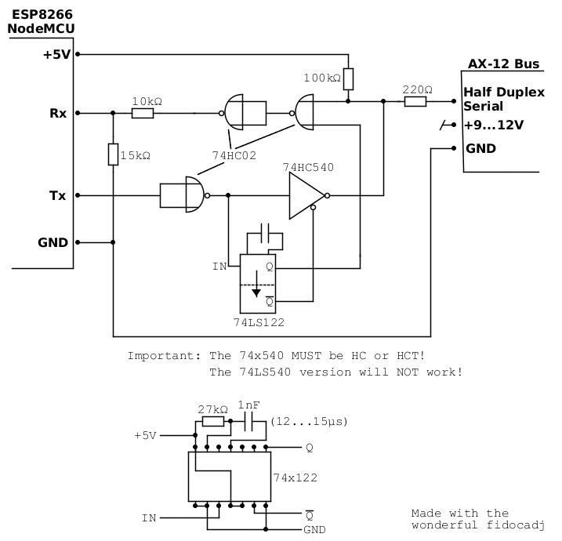

# ax12esp

This library can control dynamixel AX-12 digital servos from tossen robotics with an ESP8266 microcontroller.

This library came originaly from arbotiX, and was modified in 2009 by Pablo Gindel to be used with arduino controllers.

### AX-12 digital servos
AX-12 digital servos are controled via a half duplex asynchronous serial protocol at 1 Mbit/s.
That made it hard to be used with 16 MHz arduino microcontrollers with HW UARTS without HW FIFO.

### ESP8266 microcontroller
The ESP8266 microcontroller became available in 2015, costs less than 4 Euro and has WiFi with full TCP/IP stack integrated.
It runs at 80 MHz and has a UART with HW buffer, what makes it ideal to control AX-12 digital servos.
On top of all this, the ESP8266 was fully integrated into the arduino IDE in 2016.
There are very good breakout boards named NodeMCU for less than 8 Euro. (Don't get confused by the pre-installed lua interpreter, it can just be overwritten.)

### Extra HW
To connect AX-12 servos to an ESP8266 you need a bit of extra HW. This is needed for full duplex / half duplex convertion and for 5V / 3.3V level conversion.

### Further usage help
I use this library in my robot project at www.roboshock.de where I have just switched from an arduino Mega to the ESP8266. More info will come soon.

